# Developer Workflow — DADOS & RISAS

Technical reference for developers contributing to or maintaining the system.

---

## 1. Repository overview

```
OVERLAYS/
├── server.js              ← Express + Socket.io backend (port 3000)
├── data/                  ← In-memory character / roll state
├── public/                ← OBS overlay HTML/CSS/JS (vanilla)
├── control-panel/         ← SvelteKit + Vite frontend (port 5173)
├── scripts/               ← setup-ip.js, stress tests
└── docs/                  ← Architecture, API, Socket events docs
```

---

## 2. First-time setup

```mermaid
flowchart TD
    A([Clone repository]) --> B[npm install\nin project root]
    B --> C[cd control-panel\nnpm install]
    C --> D{Same machine\nfor server + phone?}
    D -- Yes --> E[npm run setup-ip\nauto-detects local IP\nwrites both .env files]
    D -- No / Manual --> F[cp .env.example .env\ncp control-panel/.env.example\ncontrol-panel/.env\nEdit IP manually]
    E --> G
    F --> G[Start server:\nnode server.js]
    G --> H[Start control panel:\ncd control-panel\nnpm run dev -- --host]
    H --> I[Open OBS\nAdd Browser Source\npublic/overlay-hp.html\npublic/overlay-dice.html]
    I --> J([System running ✅])
```



---

## 3. System architecture & data flow


---

## 4. Socket.io event flow

```mermaid
sequenceDiagram
    participant Phone as 📱 Control Panel
    participant Server as 🖥️ Server
    participant Overlay as 🎬 OBS Overlay
    participant OtherClients as 👥 Other Clients

    Phone->>Server: HTTP PUT /api/characters/CH101/hp\n{ hp_current: 8 }
    Server->>Server: Update in-memory state
    Server-->>Phone: 200 OK { character }
    Server->>Overlay: Socket.io: hp_updated\n{ character, hp_current: 8 }
    Server->>OtherClients: Socket.io: hp_updated\n{ character, hp_current: 8 }

    Note over Overlay: Finds data-char-id="CH101"\nAnimates HP bar\nChecks health threshold
```



---

## 5. REST API quick reference

| Method | Endpoint | Action | Socket event emitted |
|--------|----------|--------|----------------------|
| GET | `/api/characters` | List all characters | — |
| POST | `/api/characters` | Create character | `character_created` |
| PUT | `/api/characters/:id` | Edit character fields | `character_updated` |
| PUT | `/api/characters/:id/hp` | Update HP | `hp_updated` |
| PUT | `/api/characters/:id/photo` | Set photo | `character_updated` |
| POST | `/api/characters/:id/conditions` | Add condition | `condition_added` |
| DELETE | `/api/characters/:id/conditions/:cid` | Remove condition | `condition_removed` |
| PUT | `/api/characters/:id/resources/:rid` | Update resource pool | `resource_updated` |
| POST | `/api/characters/:id/rest` | Short / long rest | `rest_taken` |
| POST | `/api/rolls` | Log dice roll | `dice_rolled` |

---

## 6. HP health-state thresholds

| HP % | Color | Overlay behaviour |
|------|-------|-------------------|
| > 60% | Green (healthy) | Steady bar |
| 30–60% | Orange (injured) | Steady bar |
| < 30% | Red (critical) | Pulse animation |
| 0% | Red (dead) | No pulse |

These thresholds are defined in **both** the Svelte components (`hpClass`) and the overlay CSS. Keep them in sync when changing.

---

## 7. Development cycle

```mermaid
flowchart TD
    A([Make code change]) --> B{Which layer?}
    B -- Backend server.js --> C[Restart: node server.js\nOverlays reconnect automatically]
    B -- Control panel\nSvelte components --> D[Vite HMR updates\nbrowser automatically]
    B -- Overlay HTML/CSS --> E[Right-click OBS Browser Source\n→ Refresh / Interact → console]
    C --> F[Manual test\ncurl or test.http]
    D --> F
    E --> F
    F --> G{Tests pass?}
    G -- Yes --> H[npx playwright test\napp.test.js]
    G -- No --> A
    H --> I([Commit & push ✅])
```



---

## 8. Testing

```bash
# Playwright E2E tests
npx playwright test app.test.js --config tests-log/playwright.config.js

# Quick API smoke test
curl http://localhost:3000/api/characters

# Manual HP update
curl -X PUT http://localhost:3000/api/characters/CH101/hp \
  -H "Content-Type: application/json" \
  -d '{"hp_current": 5}'

# k6 stress tests (install k6 first)
npm run stress:api
npm run stress:cp
```

See [`docs/testing.md`](../docs/testing.md) for full testing guide.

---

## 9. Adding a new overlay

```mermaid
flowchart TD
    A([Decide overlay purpose]) --> B[Create public/overlay-NAME.html\n+ overlay-NAME.css]
    B --> C[Add Socket.io CDN script\nConnect to ?server= param]
    C --> D[Listen for relevant\nSocket.io events]
    D --> E[Use data-char-id attributes\nfor DOM targeting]
    E --> F[Test in browser\nwith ?server=http://localhost:3000]
    F --> G[Add as Browser Source in OBS\n1920×1080, transparent bg]
    G --> H([Done ✅])
```



**Key rules for overlays:**
- Always read server URL from `?server=` query param, default to `http://localhost:3000`
- Use `data-char-id` attributes on elements that must update per-character
- Only mutate the matching DOM node on events, never re-render the full list

---

## 10. Environment variables

| File | Variable | Default | Purpose |
|------|----------|---------|---------|
| `.env` | `PORT` | `3000` | Server listen port (number only) |
| `.env` | `CONTROL_PANEL_ORIGIN` | `http://localhost:5173` | CORS allowed origin (full host + port URL) |
| `.env` | `CHARACTERS_TEMPLATE` | `template-characters` | Seed data file in `data/` |
| `control-panel/.env` | `VITE_SERVER_URL` | `http://localhost:3000` | Backend URL for Svelte app (full host + port URL) |
| `control-panel/.env` | `VITE_PORT` | `5173` | Vite dev server port (number only) |

Run `npm run setup-ip` to auto-populate both files with your machine's local IP.
