# Para El Sentido del Humor Producciones
## Cómo funciona DADOS & RISAS en sus shows

> **Este documento es para ustedes** — sin código, sin tecnicismos.  
> Solo lo que necesitan saber para decidir si esto encaja en su contenido.

> ⚠️ **Esto es un demo funcional.** El sistema ya corre y hace todo lo que se describe aquí. Si el piloto se confirma, podemos agregar base de datos, personalización de marca, sonidos, y cualquier función que quieran. Este es el punto de partida.

---

## ¿Qué problema resuelve esto?

Graban 3 a 5 horas de D&D. En edición tienen que revisar horas de material para encontrar los momentos más graciosos, los combates más tensos, las tiradas críticas.

Con DADOS & RISAS, **cada acción del juego queda registrada con timestamp**. El editor sabe exactamente en qué minuto del footage ocurrió cada tirada de dado, cada cambio de HP, cada momento memorable. Menos tiempo buscando, más tiempo editando lo bueno.

Además, los jugadores no necesitan hojas de papel — tienen sus fichas en el celular, actualizadas en tiempo real, y pueden enfocarse en ser graciosos en lugar de calcular números.

---

## El sistema completo — tres partes

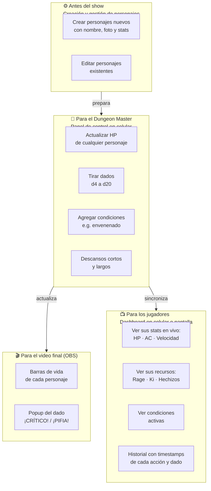

**Tres beneficios en uno:**
1. **Los editores** tienen timestamps de cada momento — edición más rápida y precisa
2. **Los jugadores** tienen sus fichas en el celular, actualizadas automáticamente
3. **La audiencia** (grabación o stream) ve todo lo que pasa en pantalla

---

## El beneficio principal: timestamps para post-producción

Cada acción del sistema queda registrada automáticamente con la hora exacta.

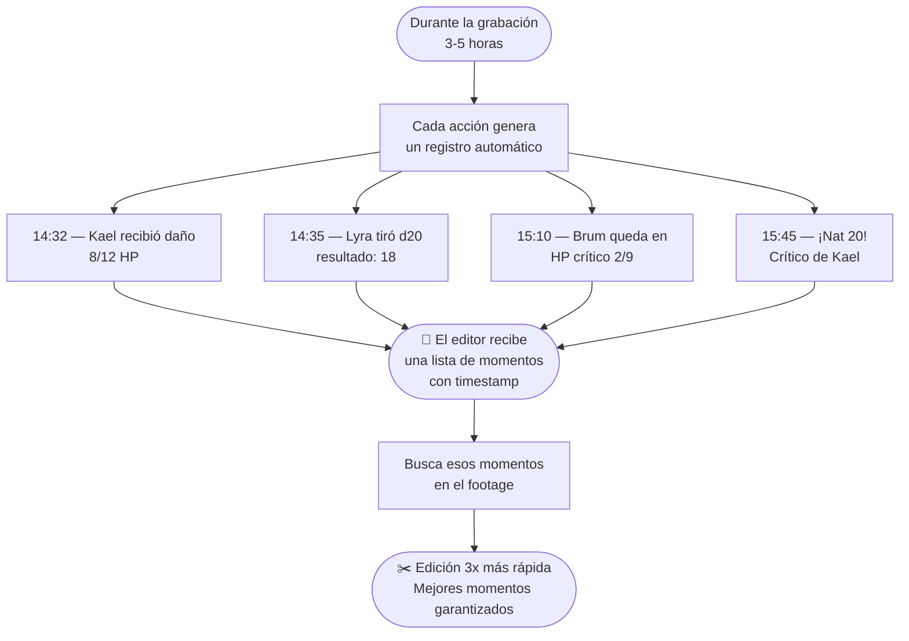

**Sin el sistema:** el editor revisa 4 horas de video para encontrar el momento en que alguien tiró un crítico.  
**Con el sistema:** el editor sabe que fue a las 15:45 y va directo.

---

## La experiencia completa — de un vistazo

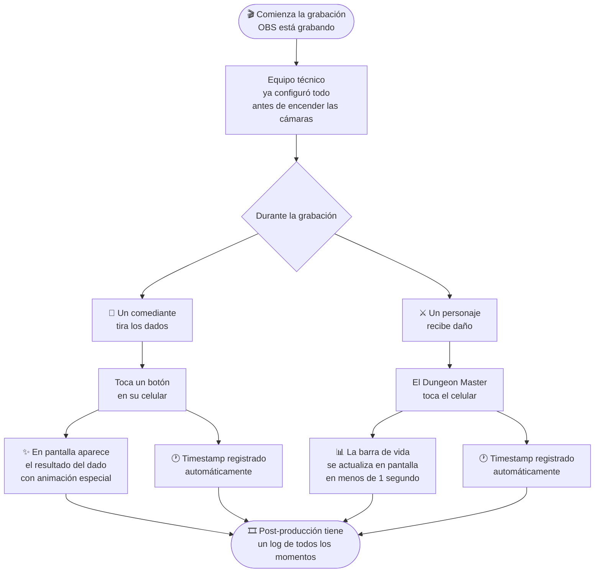

---

## Lo que aparece en pantalla (grabación o stream)

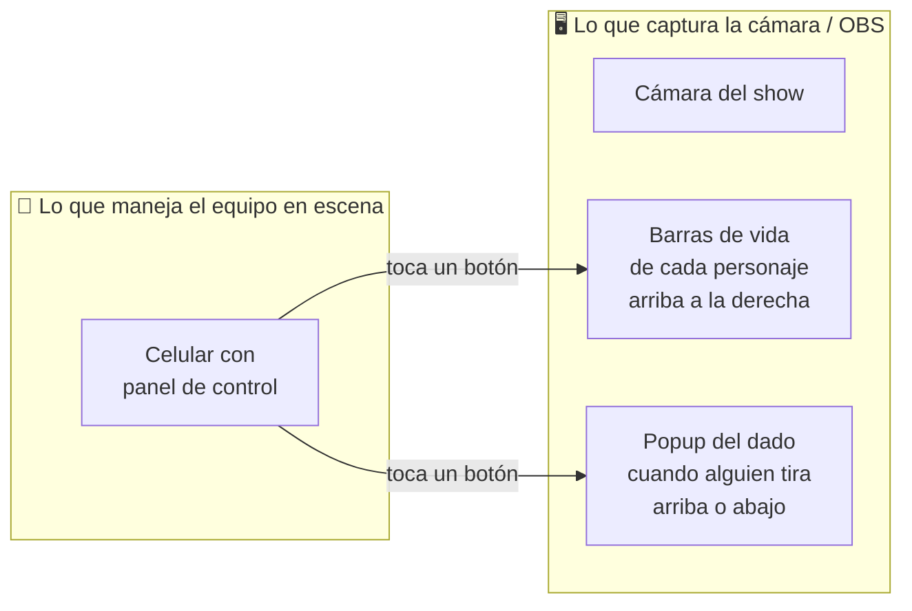

**Todo sucede en tiempo real durante la grabación. Queda capturado directamente en el video — sin agregar nada en edición.**

---

## Los tres momentos que hacen reaccionar

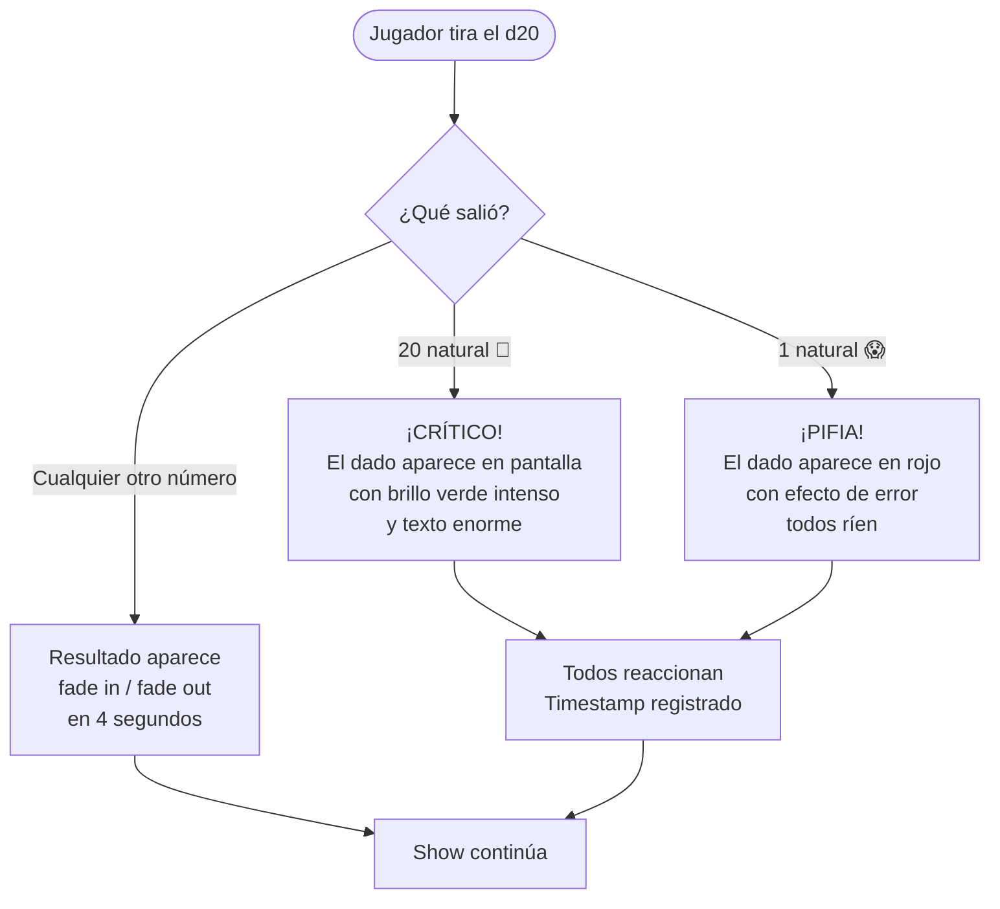

---

## Cómo se ve una sesión típica

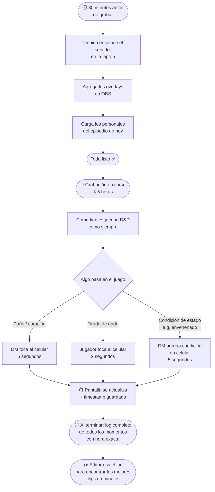

---

## Los jugadores tienen su ficha en el celular — sin papel

Uno de los mayores beneficios del sistema es que **los jugadores no necesitan hojas de papel**. Cada jugador puede abrir el Dashboard en su propio teléfono y ver su personaje actualizado en tiempo real.

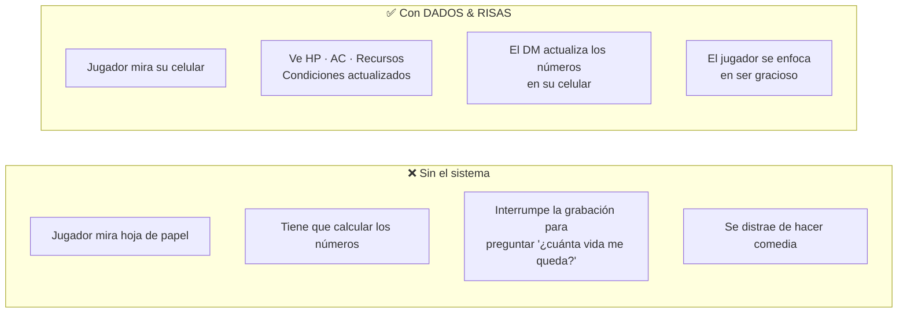

**Lo que cada jugador ve en su celular (Dashboard):**

| Información | Ejemplo |
|-------------|---------|
| HP actual / máximo | 8 / 12 |
| HP temporal | +3 |
| Armadura (AC) | 15 |
| Velocidad | 30 ft |
| Atributos | STR 16 · DEX 12 · CON 14 · INT 8 · WIS 10 · CHA 18 |
| Condiciones activas | Envenenado · nivel 1 |
| Recursos con cargas | Furia: 2/3 (recarga: descanso corto) |
| Últimas 10 acciones con hora | 14:32 Kael HP → 8/12 |
| Últimos 10 dados con hora | 14:35 Lyra tiró 18 (d20+2) |

**Todo se actualiza automáticamente.** Cuando el DM actualiza el HP desde su celular, el dashboard del jugador refleja el cambio en menos de 1 segundo.

---

## Crear y gestionar personajes

Antes de cada episodio, el equipo técnico (o el productor) usa el panel de gestión para preparar los personajes del show. No requiere programación — es un formulario web.

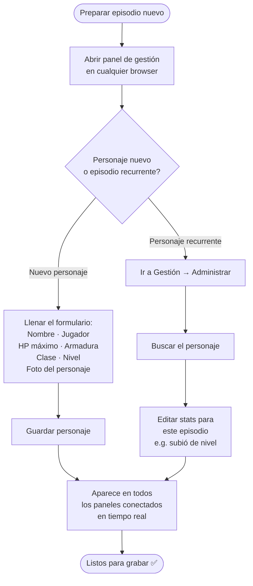

**Opciones de foto para cada personaje:**
- Elegir arte predefinido (bárbaro, elfo, mago)
- Pegar una URL de imagen externa
- Subir una imagen desde el dispositivo (fan art, fotos del equipo, etc.)

> **Nota sobre persistencia:** En este demo, los datos se guardan en memoria — si el servidor se reinicia, hay que volver a cargar los personajes. Si el piloto se confirma, agregamos una base de datos y los personajes persisten entre sesiones sin hacer nada.

---

## ¿Qué necesitan ustedes hacer?

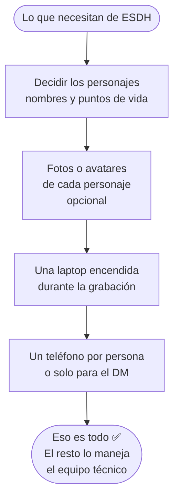

**No necesitan saber programar. No necesitan tocar código. No necesitan instalar nada en sus teléfonos.**

---

## Lo que hace el equipo técnico (una sola vez)

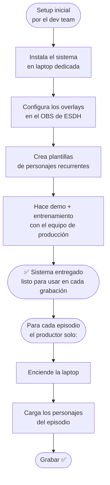

---

## ¿Qué pueden personalizar?

| Elemento | ¿Se puede cambiar? | Ejemplos |
|----------|-------------------|----------|
| Colores de las barras de vida | ✅ Sí | Colores de ESDH, branding del show |
| Fuente y tipografía | ✅ Sí | La que usen en sus thumbnails |
| Posición de los overlays | ✅ Sí | Arriba, abajo, costado |
| Texto de ¡CRÍTICO! / ¡PIFIA! | ✅ Sí | Frases propias del show |
| Sonidos al tirar dados | ✅ Sí | Efectos de audio personalizados |
| Avatares de personajes | ✅ Sí | Fan art, fotos, ilustraciones |
| Nombre del show en overlays | ✅ Sí | "DADOS & RISAS" o su marca |
| Funciones nuevas | ✅ Sí | Lo que quieran si el piloto avanza |

---

## Comparación: con y sin el sistema

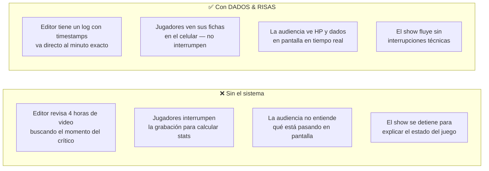

---

## Preguntas frecuentes

**¿Los jugadores necesitan instalar alguna app?**  
No. El panel de control y el dashboard son páginas web. Los jugadores abren el navegador de su celular, escriben la URL, y listo.

**¿Cuántas pantallas necesitan?**  
Como mínimo una (la laptop con OBS). Idealmente: una pantalla para OBS capturando, y los jugadores con el dashboard en su propio celular. Si tienen una TV en la mesa, pueden mostrar el dashboard ahí para que todos lo vean.

**¿Funciona también para livestream?**  
Sí. Si en algún momento quieren hacer el show en vivo, el sistema funciona exactamente igual. El foco del pitch es la grabación, pero el livestream no requiere ningún cambio.

**¿Qué pasa si se corta internet durante la grabación?**  
El sistema no necesita internet — funciona completamente en la red local (Wi-Fi entre la laptop y los teléfonos). Internet solo es necesario si están transmitiendo en vivo; para grabación, no hace falta.

**¿Pueden usarlo para múltiples episodios?**  
Sí. Antes de cada grabación, cargan los personajes del episodio (toma minutos). Si el piloto se confirma, agregamos una base de datos y los personajes persisten automáticamente entre sesiones.

**¿Cuántos personajes pueden tener en pantalla?**  
El sistema soporta múltiples personajes. Para un show, entre 3 y 6 personajes es lo ideal visualmente.

**¿Qué pasa si un personaje cambia de episodio a episodio (sube de nivel, nuevo equipo)?**  
El productor o DM edita el personaje en el panel de gestión antes del show. Cambia los stats, sube el nivel, actualiza la foto si quieren. Todo se actualiza en tiempo real cuando se guarda.

**¿Pueden pedir funciones nuevas?**  
Sí. Este es el punto de partida. Si el piloto avanza, podemos agregar lo que necesiten: base de datos, nuevo overlay, integración con su software de edición, sonidos personalizados, lo que sea.

---

## El pitch en una sola imagen

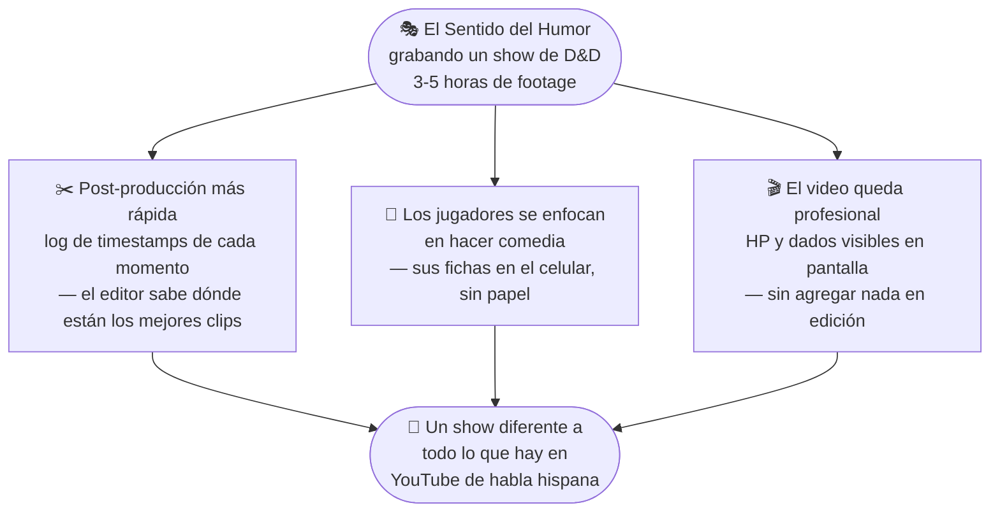

---

> *"Este es el MVP — si el piloto avanza, podemos agregar lo que necesiten."*  
> — Equipo DADOS & RISAS
