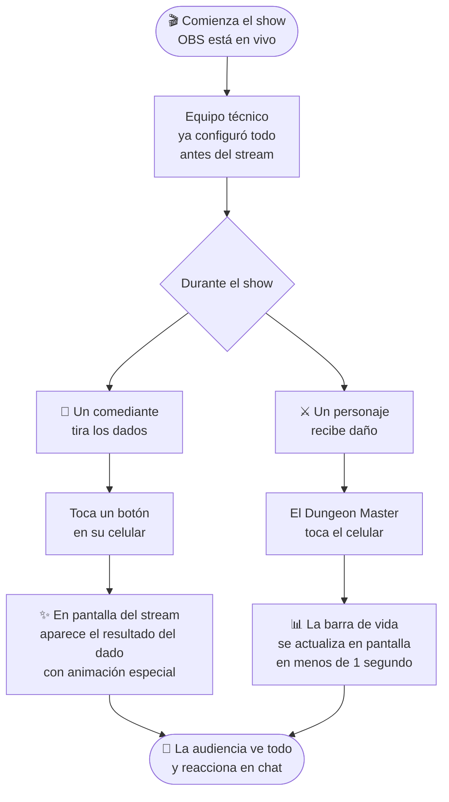
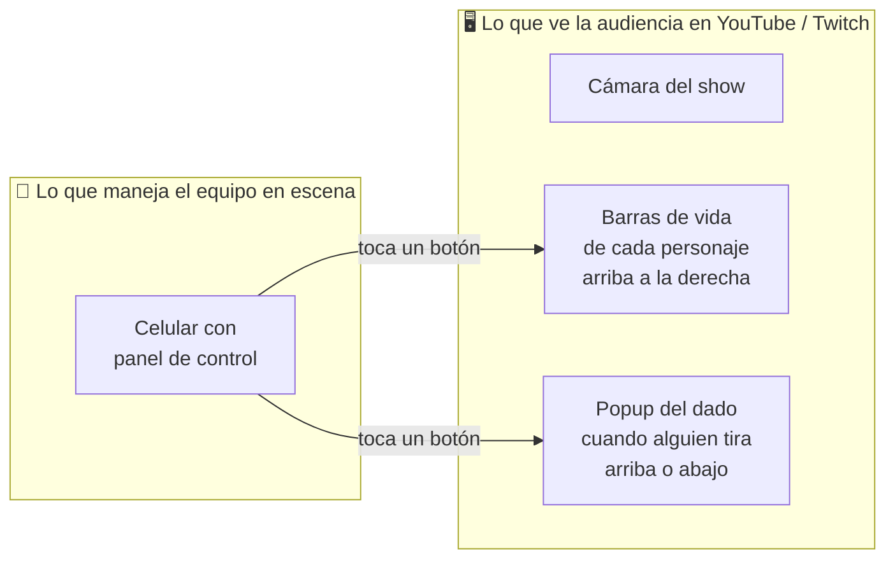
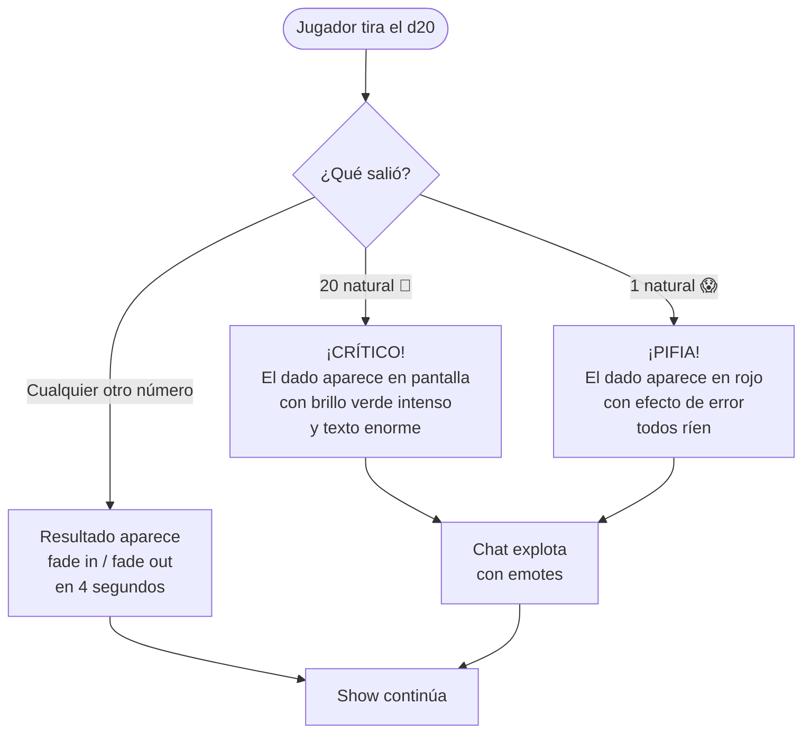
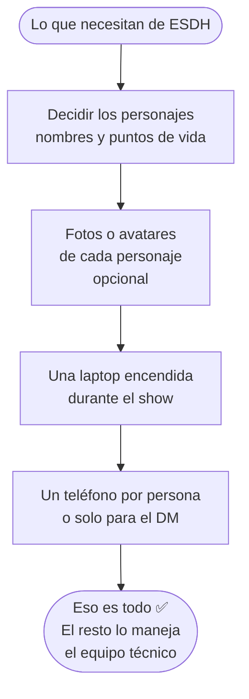
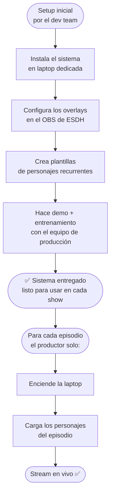
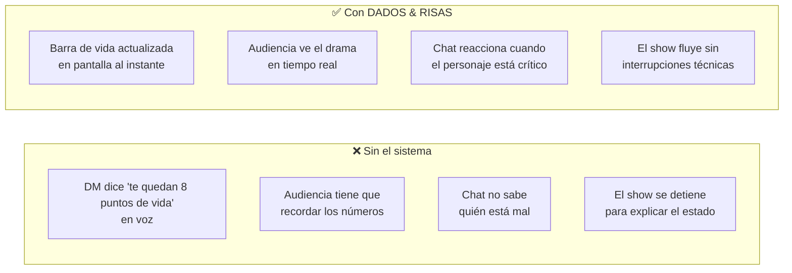
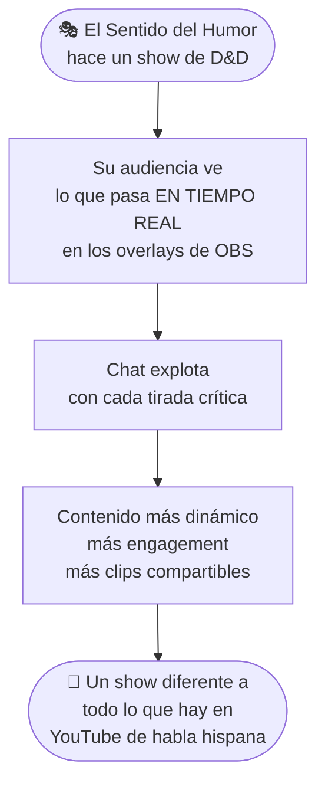

# Para El Sentido del Humor Producciones
## Cómo funciona DADOS & RISAS en sus shows

> **Este documento es para ustedes** — sin código, sin tecnicismos.  
> Solo lo que necesitan saber para decidir si esto encaja en su contenido.

---

## ¿Qué problema resuelve esto?

Cuando hacen un show de D&D en vivo o en stream, su audiencia no puede ver qué está pasando en la mesa: ¿Cuánta vida le queda al personaje? ¿Qué salió en ese dado? Con DADOS & RISAS, **todo eso aparece automáticamente en pantalla**, en tiempo real, sin que el equipo técnico tenga que tocar nada durante el show.

---

## La experiencia completa — de un vistazo

---

## Lo que ve la audiencia en stream

**Todo sucede de forma automática y en tiempo real. No hay delays. No hay edición en post.**

---

## Los tres momentos que hacen reaccionar al chat

---

## Cómo se ve una sesión típica

---

## ¿Qué necesitan ustedes hacer?

**No necesitan saber programar. No necesitan tocar código. No necesitan instalar nada en sus teléfonos.**

---

## Lo que hace el equipo técnico (una sola vez)

---

## ¿Qué pueden personalizar?

| Elemento | ¿Se puede cambiar? | Ejemplos |
|----------|-------------------|----------|
| Colores de las barras de vida | ✅ Sí | Colores de ESDH, branding del show |
| Fuente y tipografía | ✅ Sí | La que usen en sus thumbnails |
| Posición de los overlays | ✅ Sí | Arriba, abajo, costado |
| Texto de ¡CRÍTICO! / ¡PIFIA! | ✅ Sí | Frases propias del show |
| Sonidos al tirar dados | ✅ Sí | Efectos de audio custom |
| Avatares de personajes | ✅ Sí | Fan art, fotos, ilustraciones |
| Nombre del show en overlays | ✅ Sí | "DADOS & RISAS" o su marca |

---

## Comparación: con y sin el sistema

---

## Preguntas frecuentes

**¿Funciona con Twitch y YouTube al mismo tiempo?**  
Sí. El sistema actualiza OBS, que transmite a donde sea que estén haciendo stream.

**¿Qué pasa si se corta internet durante el show?**  
El sistema no necesita internet — funciona completamente en la red local (Wi-Fi entre la laptop y los teléfonos). Si se cae el Wi-Fi local, los overlays muestran el último estado conocido y se reconectan solos cuando vuelve la señal. Internet solo es necesario para transmitir el stream a YouTube o Twitch, no para el sistema de overlays en sí.

**¿Pueden usarlo en shows grabados (no en vivo)?**  
Sí. Funciona igual para grabaciones. El resultado se ve igual en el video final.

**¿Cuántos personajes pueden tener en pantalla?**  
El sistema soporta múltiples personajes. Para un show, entre 3 y 6 personajes es lo ideal visualmente.

**¿Necesitan tener internet en el lugar del show?**  
Solo necesitan una red local (Wi-Fi entre la laptop y los teléfonos). No necesitan internet para que el sistema funcione entre sus dispositivos.

---

## El pitch en una sola imagen

---

> *"Este es el MVP — puedo agregar lo que necesiten."*  
> — Equipo DADOS & RISAS
