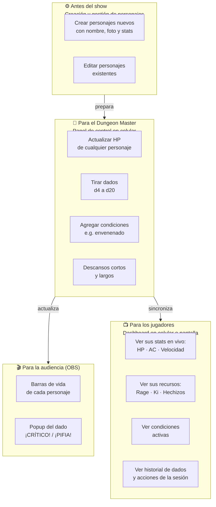
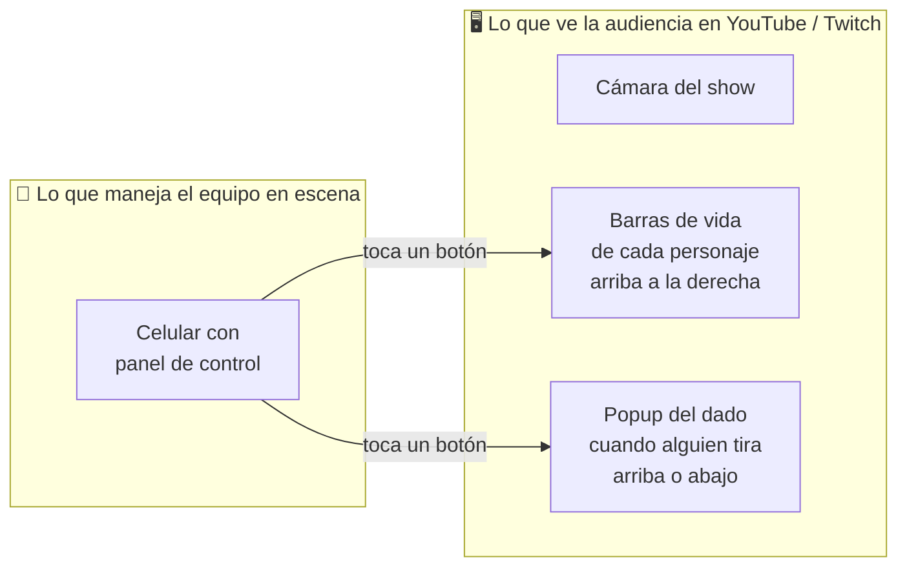
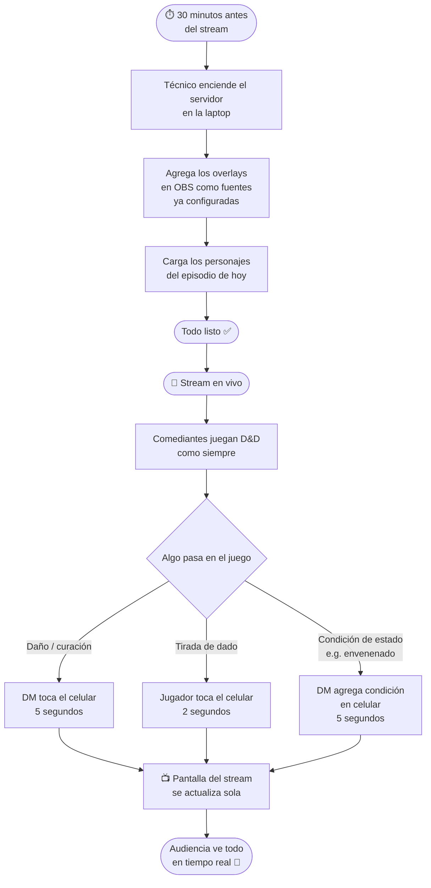
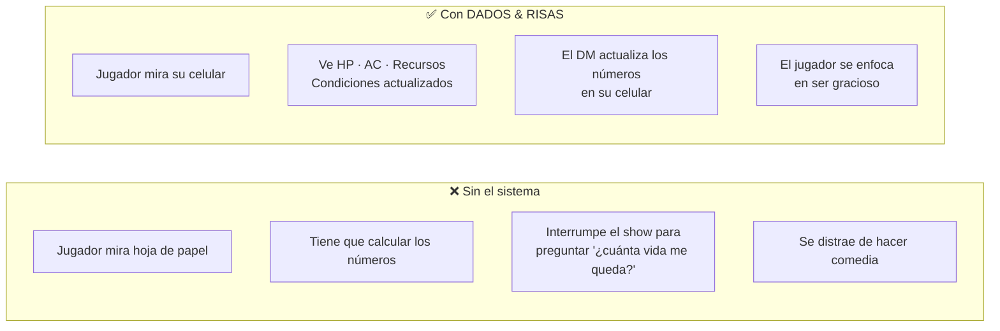
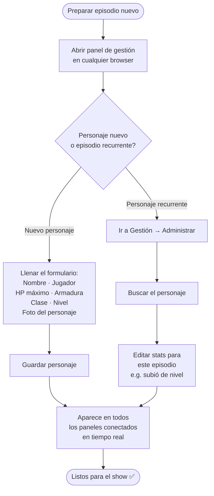
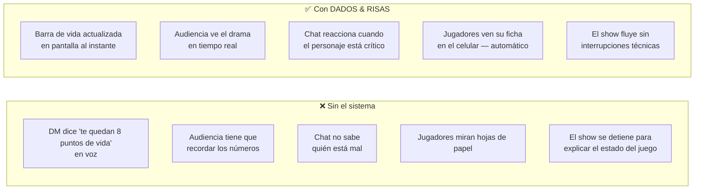
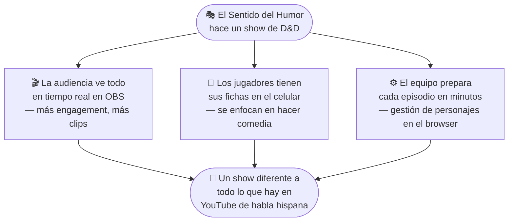

# Para El Sentido del Humor Producciones
## Cómo funciona DADOS & RISAS en sus shows

> **Este documento es para ustedes** — sin código, sin tecnicismos.  
> Solo lo que necesitan saber para decidir si esto encaja en su contenido.

---

## ¿Qué problema resuelve esto?

Cuando hacen un show de D&D en vivo o en stream, su audiencia no puede ver qué está pasando en la mesa: ¿Cuánta vida le queda al personaje? ¿Qué salió en ese dado? Y los jugadores tienen que estar mirando hojas de papel en lugar de enfocarse en ser graciosos.

Con DADOS & RISAS, **todo eso se resuelve de una sola vez**: la audiencia ve todo en pantalla en tiempo real, y los jugadores tienen sus fichas de personaje en su propio celular — actualizadas automáticamente, sin tocar nada manualmente.

---

## El sistema completo — tres partes

**Tres beneficios en uno:**
1. **La audiencia** ve todo lo que pasa en tiempo real
2. **Los jugadores** tienen sus fichas en el celular, actualizadas automáticamente
3. **El DM** controla todo desde el celular con unos toques

---

## La experiencia completa — de un vistazo

---

## Lo que ve la audiencia en stream

**Todo sucede de forma automática y en tiempo real. No hay delays. No hay edición en post.**

---

## Los tres momentos que hacen reaccionar al chat

---

## Cómo se ve una sesión típica

---

## Los jugadores tienen su ficha en el celular — sin papel

Uno de los mayores beneficios del sistema es que **los jugadores no necesitan hojas de papel**. Cada jugador puede abrir el Dashboard en su propio teléfono y ver su personaje actualizado en tiempo real.

**Lo que cada jugador ve en su celular (Dashboard):**

| Información | Ejemplo |
|-------------|---------|
| HP actual / máximo | 8 / 12 |
| HP temporal | +3 |
| Armadura (AC) | 15 |
| Velocidad | 30 ft |
| Atributos | STR 16 · DEX 12 · CON 14 · INT 8 · WIS 10 · CHA 18 |
| Condiciones activas | Envenenado · nivel 1 |
| Recursos con cargas | Furia: 2/3 (recarga: descanso corto) |
| Últimas 10 acciones | 14:32 Kael HP → 8/12 |
| Últimos 10 dados | 14:35 Lyra tiró 18 (d20+2) |

**Todo se actualiza automáticamente.** Cuando el DM actualiza el HP desde su celular, el dashboard del jugador refleja el cambio en menos de 1 segundo.

---

## Crear y gestionar personajes

Antes de cada episodio, el equipo técnico (o el productor) usa el panel de gestión para preparar los personajes del show. No requiere programación — es un formulario web.

**Opciones de foto para cada personaje:**
- Elegir arte predefinido (bárbaro, elfo, mago)
- Pegar una URL de imagen externa
- Subir una imagen desde el dispositivo (fan art, fotos del equipo, etc.)

---

## ¿Qué necesitan ustedes hacer?

**No necesitan saber programar. No necesitan tocar código. No necesitan instalar nada en sus teléfonos.**

---

## Lo que hace el equipo técnico (una sola vez)

---

## ¿Qué pueden personalizar?

| Elemento | ¿Se puede cambiar? | Ejemplos |
|----------|-------------------|----------|
| Colores de las barras de vida | ✅ Sí | Colores de ESDH, branding del show |
| Fuente y tipografía | ✅ Sí | La que usen en sus thumbnails |
| Posición de los overlays | ✅ Sí | Arriba, abajo, costado |
| Texto de ¡CRÍTICO! / ¡PIFIA! | ✅ Sí | Frases propias del show |
| Sonidos al tirar dados | ✅ Sí | Efectos de audio custom |
| Avatares de personajes | ✅ Sí | Fan art, fotos, ilustraciones |
| Nombre del show en overlays | ✅ Sí | "DADOS & RISAS" o su marca |

---

## Comparación: con y sin el sistema

---

## Preguntas frecuentes

**¿Los jugadores necesitan instalar alguna app?**  
No. El panel de control y el dashboard son páginas web. Los jugadores abren el navegador de su celular, escriben la URL, y listo.

**¿Cuántas pantallas necesitan?**  
Como mínimo una (la laptop con OBS). Idealmente: una pantalla para OBS, y los jugadores con el dashboard en su propio celular. Si tienen una TV en la mesa, pueden mostrar el dashboard ahí para que todos lo vean.

**¿Funciona con Twitch y YouTube al mismo tiempo?**  
Sí. El sistema actualiza OBS, que transmite a donde sea que estén haciendo stream.

**¿Qué pasa si se corta internet durante el show?**  
El sistema no necesita internet — funciona completamente en la red local (Wi-Fi entre la laptop y los teléfonos). Si se cae el Wi-Fi local, los overlays muestran el último estado conocido y se reconectan solos cuando vuelve la señal. Internet solo es necesario para transmitir el stream a YouTube o Twitch, no para el sistema de overlays en sí.

**¿Pueden usarlo en shows grabados (no en vivo)?**  
Sí. Funciona igual para grabaciones. El resultado se ve igual en el video final.

**¿Cuántos personajes pueden tener en pantalla?**  
El sistema soporta múltiples personajes. Para un show, entre 3 y 6 personajes es lo ideal visualmente.

**¿Necesitan tener internet en el lugar del show?**  
Solo necesitan una red local (Wi-Fi entre la laptop y los teléfonos). No necesitan internet para que el sistema funcione entre sus dispositivos.

**¿Qué pasa si un personaje cambia de episodio a episodio (sube de nivel, nuevo equipo)?**  
El productor o DM edita el personaje en el panel de gestión antes del show. Cambia los stats, sube el nivel, actualiza la foto si quieren. Todo se actualiza en tiempo real cuando se guarda.

---

## El pitch en una sola imagen

---

> *"Este es el MVP — puedo agregar lo que necesiten."*  
> — Equipo DADOS & RISAS
