# Everyday User Workflow — DADOS & RISAS

Guide for Dungeon Masters and players who run the system during a D&D session.  
No coding required — just a phone, a laptop, and OBS.

---

## 1. What you need before the session

| Item | Notes |
|------|-------|
| Laptop / PC | Runs the server and OBS |
| Phone or tablet | DM's remote control; players open the `/dashboard` read-only view on their own device |
| OBS Studio | Free — [obsproject.com](https://obsproject.com) — needed only for streaming |
| Same Wi-Fi network | Phone and laptop must be on the same network |

---

## 2. Control Panel — full map

The control panel is a web app that opens in any browser. It has five distinct areas:

```mermaid
flowchart TD
    CP([📱 Control Panel\nopen in browser]) --> C1

    subgraph CONTROL["Control (DM remote)"]
        C1[/control/characters\nHP · Conditions · Resources · Rest]
        C2[/control/dice\nRoll d4–d20 for any character]
    end

    subgraph MANAGEMENT["Management (pre-session setup)"]
        M1[/management/create\nCreate a new character\nfull D&D 5e form]
        M2[/management/manage\nEdit existing characters\nChange photo · Stats · Class]
    end

    subgraph DASHBOARD["Dashboard (players' screen)"]
        D1[/dashboard\nRead-only live view\nHP · Conditions · Resources · Ability Scores\nAction log · Roll log]
    end

    CP --> C2
    CP --> M1
    CP --> M2
    CP --> D1
```

**Who uses what:**

| Screen | Used by | When |
|--------|---------|------|
| `/control/characters` | Dungeon Master | During combat — damage, heal, conditions, rest |
| `/control/dice` | Any player or DM | Whenever dice are rolled on-stream |
| `/management/create` | DM / Producer | Before the session — add new characters |
| `/management/manage` | DM / Producer | Before or between sessions — edit, update photo |
| `/dashboard` | Players + spectators | During the entire session — read-only reference |

---

## 3. Pre-session setup (do this once)

```mermaid
flowchart TD
    A([Open laptop]) --> B[Open terminal\ncd to OVERLAYS folder]
    B --> C[node server.js\nKeep this terminal open]
    C --> D[Open second terminal\ncd control-panel\nnpm run dev -- --host]
    D --> E[Note the Network URL shown\ne.g. http://192.168.1.50:5173]
    E --> F[Open OBS Studio]
    F --> G[Add Browser Source:\npublic/overlay-hp.html\n1920×1080]
    G --> H[Add Browser Source:\npublic/overlay-dice.html\n1920×1080]
    H --> I[On phone: open browser\ngo to the Network URL from step E]
    I --> J([Ready to play ✅])
```



---

## 4. Creating characters (before each session)

```mermaid
flowchart TD
    A([Need to add a character]) --> B[Go to /management/create\nin the control panel]
    B --> C{Fill in required fields}

    C --> D["Name (e.g. Valeria)\nPlayer (e.g. Sol)"]
    D --> E["HP Max · Armor Class · Speed"]
    E --> F{Optional D&D 5e detail}

    F -- Quick session --> G[Leave class/species/etc.\nas 'undefined'\nand submit]
    F -- Full character --> H["Choose:\nClass + Subclass + Level\nBackground + Feat\nSpecies + Size\nAlignment"]
    H --> I["Select (multi-pick):\nLanguages · Skills\nArmor & Weapon proficiencies\nEquipment & Trinket"]
    I --> J[Add a photo:\nChoose preset art, paste URL,\nor upload from device]
    G --> K
    J --> K[Tap CREATE CHARACTER]
    K --> L[Character appears instantly\non all connected screens]
    L --> M([Ready to use in session ✅])
```



**Character creation fields at a glance:**

| Section | Fields |
|---------|--------|
| Identity (required) | Name, Player |
| Combat (required) | HP Max, Armor Class, Speed |
| Class | Class, Subclass, Level |
| Background | Background, Feat, Skills, Tool proficiency |
| Species | Species, Size |
| Languages | Standard + Rare languages (multi-select) |
| Proficiencies | Skills, Tools, Armor, Weapons (multi-select) |
| Equipment | Items, Trinket |
| Photo | Preset art / External URL / Local upload |

---

## 5. Managing existing characters (edit, update photo)


---

## 6. During a session — HP management


---

## 7. During a session — Dice rolling

```mermaid
flowchart TD
    A([Player wants to roll]) --> B[Go to /control/dice\nin control panel]
    B --> C[Select the character\nwho is rolling]
    C --> D[Select the die:\nd4 / d6 / d8 / d10 / d12 / d20]
    D --> E[Tap the die to roll]
    E --> F[Server picks a random result\nbroadcasts to everyone]
    F --> G{Special result?}
    G -- Natural 20 --> H[¡CRÍTICO! popup\nGreen glow on OBS 🟢]
    G -- Natural 1 --> I[¡PIFIA! popup\nRed glow on OBS 🔴]
    G -- Anything else --> J[Result shown with total\nFades out after 4 seconds]
    H --> K([Roll logged in Dashboard\nAudience reacts 🎉])
    I --> K
    J --> K
```



---

## 8. Managing character conditions


---

## 9. Short rest / Long rest

```mermaid
flowchart TD
    A([Party takes a rest]) --> B{Short rest\nor Long rest?}
    B -- Short rest --> C[Tap CORTO on the character card\nin /control/characters]
    C --> D[Short-rest resources restore\ne.g. Bardic Inspiration, Ki points]
    B -- Long rest --> E[Tap LARGO on the character card]
    E --> F[All HP restored to max\nAll resources fully restored]
    D --> G([Resource pools update instantly\nDashboard reflects new values ✅])
    F --> G
```



---

## 10. Live Dashboard — what players see

The Dashboard (`/dashboard`) is a **read-only** live view designed to sit on a second screen, a TV at the table, or a player's own phone/tablet. Players can always see current game state without touching the DM controls.

```mermaid
flowchart LR
    subgraph CARD["Per-character card"]
        PHOTO[Character photo]
        IDENTITY["Name · Player · ID"]
        VITALS["HP current/max\nTemp HP · AC · Speed"]
        ABILITIES["STR · DEX · CON\nINT · WIS · CHA"]
        CONDITIONS["Active conditions\ne.g. Poisoned · Frightened"]
        RESOURCES["Resource pools\nRage: 2/3 · Ki: 4/4\nwith recharge type"]
    end

    subgraph LOG["Activity logs (right panel)"]
        ACTION["Last 10 actions\ntime · character · event\ne.g. 14:32 Kael HP → 8/12"]
        ROLLS["Last 10 dice rolls\ntime · character · result\ne.g. 14:35 Lyra rolled 18 (d20+2)"]
    end
```



**What updates automatically (no refresh needed):**

| Event | Dashboard updates |
|-------|-------------------|
| HP change | HP number + bar colour change |
| Condition added/removed | Condition pills appear/disappear |
| Resource spent/recovered | Pool count updates (e.g. Ki 3/4 → 2/4) |
| Short/long rest | Resources and HP reset to restored values |
| Dice roll | New entry appears at top of Roll log |
| Character created/edited | New card appears / card fields update |

**Dashboard setup for players:**
1. Players open a browser on their own phone
2. Navigate to `http://<laptop-IP>:5173/dashboard`
3. Leave it open — it stays in sync automatically for the whole session

---

## 11. Troubleshooting

| Problem | Fix |
|---------|-----|
| Phone can't open control panel | Make sure laptop and phone are on the same Wi-Fi. Use the Network URL (not localhost) |
| OBS overlay not updating | Check that `node server.js` is still running in your terminal |
| HP shows wrong value | Pull down to refresh the control panel page; server state is the source of truth |
| Dice popup didn't appear | Check OBS: right-click Browser Source → Interact → look for errors |
| Dashboard not syncing | Same network check; try closing and reopening the browser tab |
| Everything is frozen | Restart `node server.js`, then refresh OBS Browser Sources |
