# Everyday User Workflow — DADOS & RISAS

Guide for Dungeon Masters and players who run the system during a D&D session.  
No coding required — just a phone, a laptop, and OBS.

---

## 1. What you need before the session

| Item | Notes |
|------|-------|
| Laptop / PC | Runs the server and OBS |
| Phone or tablet | Becomes your session remote control |
| OBS Studio | Free — [obsproject.com](https://obsproject.com) |
| Same Wi-Fi network | Phone and laptop must be on the same network |

---

## 2. Pre-session setup (do this once)

---

## 3. During a session — HP management

```mermaid
flowchart TD
    A([Something happens\nin combat]) --> B{Damage or Healing?}

    B -- Damage --> C[Open control panel on phone\nGo to Characters tab]
    C --> D[Find the character\nTap ➖ to reduce HP]
    D --> E{HP level?}
    E -- above 60% --> F[Bar stays green\n— character is healthy]
    E -- 30–60% --> G[Bar turns orange\n— character is injured]
    E -- below 30% --> H[Bar turns red and pulses\n— character is critical!]
    E -- 0 --> I[Bar hits zero\n— character is down]

    B -- Healing --> J[Tap ➕ to increase HP]
    J --> K[Bar animates back up\nto the new value]

    F --> L([OBS overlay updates\nin under 1 second ✅])
    G --> L
    H --> L
    I --> L
    K --> L
```

---

## 4. During a session — Dice rolling

```mermaid
flowchart TD
    A([Player wants to roll]) --> B[Go to Dice tab\nin control panel]
    B --> C[Select the die:\nd4 / d6 / d8 / d10 / d12 / d20]
    C --> D[Tap the die to roll]
    D --> E[Server picks a random result\nbroadcasts to everyone]
    E --> F{Special result?}
    F -- Natural 20 --> G[¡CRÍTICO! popup\nGreen glow on OBS 🟢]
    F -- Natural 1 --> H[¡PIFIA! popup\nRed glow on OBS 🔴]
    F -- Anything else --> I[Result shown with total\nFades out after 4 seconds]
    G --> J([Audience reacts 🎉])
    H --> J
    I --> J
```

---

## 5. Managing character conditions

```mermaid
flowchart TD
    A([Character gains a condition\ne.g. Poisoned, Frightened]) --> B[Go to Characters tab\nFind the character]
    B --> C[Tap Add Condition]
    C --> D[Select condition name\nand intensity]
    D --> E[Condition icon appears\non the character card]
    E --> F([All connected screens update ✅])

    G([Condition ends]) --> H[Tap the condition icon\nto remove it]
    H --> F
```

---

## 6. Short rest / Long rest

```mermaid
flowchart TD
    A([Party takes a rest]) --> B{Short rest\nor Long rest?}
    B -- Short rest --> C[Tap Short Rest\nfor each character]
    C --> D[Short-rest resources\ne.g. Bardic Inspiration\nrestore automatically]
    B -- Long rest --> E[Tap Long Rest\nfor each character]
    E --> F[All HP restored to max\nAll resources restored]
    D --> G([Resource pools\nupdate instantly ✅])
    F --> G
```

---

## 7. Adding / editing characters

```mermaid
flowchart TD
    A([New character needed]) --> B[Go to Management tab\nin control panel]
    B --> C[Tap Create Character]
    C --> D[Fill in: Name, Player,\nClass, HP max, AC, Speed]
    D --> E[Add a photo\nURL or upload from device]
    E --> F[Tap Save]
    F --> G[Character appears\non all connected screens]
    G --> H([Ready to use in session ✅])

    I([Edit existing character]) --> J[Management → Manage tab]
    J --> K[Find character, tap Edit]
    K --> L[Change fields, tap Save]
    L --> G
```

---

## 8. Dashboard view (read-only)

Open the **Dashboard** tab in the control panel to see a live overview of all characters — HP, conditions, and resources — without accidentally changing anything.  
Useful on a second screen or shared with spectators.

---

## 9. Troubleshooting

| Problem | Fix |
|---------|-----|
| Phone can't open control panel | Make sure laptop and phone are on the same Wi-Fi. Use the Network URL (not localhost) |
| OBS overlay not updating | Check that `node server.js` is still running in your terminal |
| HP shows wrong value | Pull down to refresh the control panel page; server state is the source of truth |
| Dice popup didn't appear | Check OBS: right-click Browser Source → Interact → look for errors |
| Everything is frozen | Restart `node server.js`, then refresh OBS Browser Sources |
