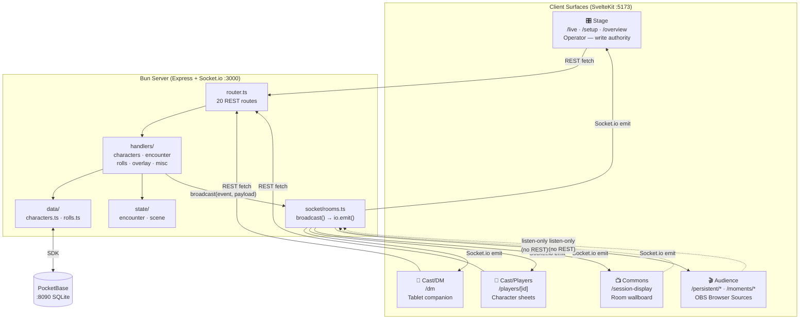

# Architecture Guide

> Quick-reference map for navigating the TableRelay codebase (repo currently named `OVERLAYS`, rename pending).

Fast lookup: see [docs/INDEX.md](docs/INDEX.md).

---

## System Overview



Every client connects to the same Socket.io server. When a write-capable surface (Stage, Cast/DM, Cast/Players) sends a REST request, the server writes to PocketBase, responds to the caller, then broadcasts a Socket.io event to **all** connected clients. Audience overlays and Commons **never send REST requests** — they are listen-only.

PocketBase runs as a separate process (`.\pocketbase.exe serve`) and must be started before the Node server.

---

## Functional Areas

| Surface | Route group | Users | Authority | Key components |
| --- | --- | --- | --- | --- |
| **Stage** | `(stage)` | Operators | Primary write — HP, conditions, resources, dice, setup | CharacterCard, DiceRoller, CharacterManagement, CharacterCreationForm |
| **Cast/DM** | `(cast)/dm` | DM | Encounter management, scene control, NPC reference | InitiativeStrip, SessionBar, SessionCard |
| **Cast/Players** | `(cast)/players/[id]` | Players | Character sheet — read + safe field writes | CharacterSheet, ResourceTracker, PlayerHeader |
| **Commons** | `(commons)` | Whole room | Passive wallboard, no controls | (session-display — Phase 3) |
| **Audience** | `(audience)` | OBS/vMix | Payload-driven overlays, listen-only | OverlayHP, OverlayDice, OverlayConditions, OverlayTurnOrder, OverlayCharacterFocus, OverlaySceneTitle, moments/*, show/* |

### Backend clusters (from knowledge graph)

| Cluster | Symbols | Cohesion | What it contains |
| --- | --- | --- | --- |
| **Handlers** | 29 | 81% | All REST handler functions — `updateHp`, `batchUpdateHp`, `addCondition`, `removeCondition`, `updateResource`, `restoreResources`, `createCharacter`, `nextTurn`, `levelUp`, `changeScene`, `focusCharacter`, `logRoll` |
| **Data** | 18 | 88% | PocketBase CRUD layer — `findById`, `updateHp`, `addCondition`, `removeCondition`, `updateResource`, `restoreResources`, `removeCharacter`, `logRoll`, `createShortId` |
| **Services** (frontend) | ~15 OVERLAYS | 86% | `bindSocketListeners`, `addCondition`, `removeCondition`, `getCharacter`, `listActiveCharacters`, `ServiceError` |

---

## File Map

### Backend (`/`)

#### Entry point

| File | Purpose |
|---|---|
| `server.ts` | Thin entry point (~75 lines). Initializes Express, Socket.io, PocketBase auth, seed, and token refresh timer. Delegates all routing to `src/server/router.ts` and socket setup to `src/server/socket/index.ts`. |

#### `src/server/` modules

| File                              | Purpose                                                                             | Key exports |
| --------------------------------- | ----------------------------------------------------------------------------------- | ----------- |
| `src/server/pb.ts`                | PocketBase singleton + auth helpers                                                 | `pb`, `connectToPocketBase`, `ensureAuth` |
| `src/server/seed.ts`              | Seeds empty collections on startup (characters, NPC data, campaign context)         | `seedIfEmpty` |
| `src/server/router.ts`            | Express `Router` — mounts all 20 REST routes                                        | `default` (Router) |
| `src/server/handlers/characters.ts` | All `/api/characters/*` REST handlers                                             | `listCharacters`, `createCharacter`, `updateHp`, `updatePhoto`, `updateCharacter`, `addCondition`, `removeCondition`, `deleteCharacter`, `updateResource`, `restoreResources`, `batchUpdateHp` |
| `src/server/handlers/encounter.ts`  | `/api/encounter/*` REST handlers                                                  | `getEncounter`, `startEncounter`, `nextTurn`, `endEncounter` |
| `src/server/handlers/overlay.ts`    | `/api/announce`, `/api/level-up`, `/api/player-down`, `/api/lower-third`          | `announce`, `levelUp`, `playerDown`, `lowerThird` |
| `src/server/handlers/rolls.ts`      | `POST /api/rolls`                                                                 | `logRoll` |
| `src/server/handlers/misc.ts`       | `/api/info`, `/api/tokens`, `/api/sync-start`, `/api/scene`, `/api/character-focus` | `getInfo`, `getTokens`, `syncStart`, `getScene`, `changeScene`, `focusCharacter`, `preloadTokens`, `getMainIP` |
| `src/server/socket/index.ts`        | `initSocket(io)` — wires connection handler + `initialData` emit                  | `initSocket` |
| `src/server/socket/rooms.ts`        | All `io.emit()` calls go through here; JSONL sidecar logger at `logs/sidecar.jsonl` | `initRooms`, `broadcast`, `setSyncStartTime`, `getSyncStartTime` |
| `src/server/socket/events/character.ts` | Stub — `registerCharacterEvents()` (Phase 2)                                  | `registerCharacterEvents` |
| `src/server/socket/events/combat.ts`    | Stub — `registerCombatEvents()` (Phase 2)                                     | `registerCombatEvents` |
| `src/server/socket/events/session.ts`   | Stub — `registerSessionEvents()` (Phase 2)                                    | `registerSessionEvents` |
| `src/server/state/encounter.ts`     | In-memory encounter state (active, round, participants)                           | `getEncounterState`, `setEncounterState` |
| `src/server/state/scene.ts`         | In-memory scene + focused character state                                         | `getSceneState`, `setSceneState`, `getFocusedChar`, `setFocusedChar` |

#### TypeScript data modules

| File                 | Purpose                                                        | Key exports                                                                                               |
| -------------------- | -------------------------------------------------------------- | --------------------------------------------------------------------------------------------------------- |
| `src/server/data/characters.ts` | PocketBase character CRUD — all functions are async and require `pb` as first arg | `getAll`, `findById`, `createCharacter`, `updateCharacterData`, `updateHp`, `updatePhoto`, `addCondition`, `removeCondition`, `updateResource`, `restoreResources`, `removeCharacter` |
| `src/server/data/rolls.ts`      | PocketBase roll history — async, requires `pb` as first arg   | `getAll`, `logRoll`                                                                                       |
| `src/server/data/id.ts`         | Short 5-character ID generator (still used by `addCondition`) | `createShortId`                                                                                           |

### Control Panel (`/control-panel/src/`)

The control panel is a **SvelteKit** application. File-based routes live under `routes/`; reusable components and stores live under `lib/`.

#### Routes

Route groups use `(parens)` — they are organizational only and do NOT appear in URLs.

| Route path          | File                                                    | Purpose                                    |
| ------------------- | ------------------------------------------------------- | ------------------------------------------ |
| `/`                 | `routes/+page.svelte`                                   | Redirects to `/live/characters`            |
| (all routes)        | `routes/+layout.svelte`                                 | App shell: header, sidebar, navigation     |
| `/live/characters`  | `routes/(stage)/live/characters/+page.svelte`           | Character HP / conditions / resources view |
| `/live/dice`        | `routes/(stage)/live/dice/+page.svelte`                 | Dice roller view                           |
| `/live` (shared)    | `routes/(stage)/live/+layout.svelte`                    | PERSONAJES / DADOS bottom nav              |
| `/setup/create`     | `routes/(stage)/setup/create/+page.svelte`              | Character creation form                    |
| `/setup/manage`     | `routes/(stage)/setup/manage/+page.svelte`              | Photo/data editing + bulk controls         |
| `/setup` (shared)   | `routes/(stage)/setup/+layout.svelte`                   | CREAR / GESTIONAR bottom nav               |
| `/overview`         | `routes/(stage)/overview/+page.svelte`                  | Live read-only operator dashboard          |
| `/dm`               | `routes/(cast)/dm/+page.svelte`                         | Initiative tracker + SessionCards          |
| `/players/[id]`     | `routes/(cast)/players/[id]/+page.svelte`               | Player character sheet (mobile-first)      |

#### Library (`lib/`)

| File                              | Purpose                                                          | Key exports / state                                                                                          |
| --------------------------------- | ---------------------------------------------------------------- | ------------------------------------------------------------------------------------------------------------ |
| `lib/services/pocketbase.ts`             | **Canonical** typed PocketBase client                      | `pb` (singleton), `getCharacterRecord`, `updateCharacterRecord`                       |
| `lib/services/socket.ts`                 | **Canonical** typed Socket.io client                       | `connectSocket`, `disconnectSocket`, `subscribe`, `emit`, `socketStatus`, `getSocket` |
| `lib/services/character.ts`             | Character data facade                                      | `getCharacter`, `subscribeToCharacterUpdates`                                         |
| `lib/services/errors.ts`                | Standard error shape for all service throws                | `ServiceError` class, `ServiceErrorCode` type                                         |
| `lib/services/broadcast/index.ts`       | Broadcast adapter factory — returns the right adapter for OBS, vMix, or mock | `getBroadcastAdapter(config)` |
| `lib/services/broadcast/mock.ts`        | `MockBroadcastAdapter` — logs all calls; no real connection needed | `MockBroadcastAdapter` |
| `lib/services/broadcast/obs.ts`         | OBS WebSocket adapter stub (TASK-5.6)                      | —                                                                                     |
| `lib/services/broadcast/vmix.ts`        | vMix TCP adapter stub (TASK-5.6)                           | —                                                                                     |
| `lib/services/socket.js`                 | **Legacy** Socket.io singleton + Svelte stores (stage only)| `socket`, `characters` (writable), `lastRoll` (writable), `SERVER_URL`               |
| `lib/contracts/broadcast.ts`            | Broadcast adapter interface + types                        | `BroadcastAdapter`, `BroadcastConfig`, `BroadcastStatus`, `BroadcastEvent`, `TallyState` |
| `lib/contracts/records.ts`              | PocketBase record shapes                                   | `CharacterRecord`, `ResourceSlot`, `CampaignRecord`, `SessionRecord`                  |
| `lib/contracts/events.ts`               | Socket.io event payload types                              | `EventPayloadMap`, payload interfaces, event name constants                           |
| `lib/contracts/stage.ts`                | Stage surface view-model types                             | —                                                                                     |
| `lib/contracts/cast.ts`                 | Cast surface types                                         | `CharacterLiveState`                                                                  |
| `lib/contracts/overlays.ts`             | Overlay surface view-model types                           | —                                                                                     |
| `lib/contracts/rolls.ts`                | Roll record types                                          | —                                                                                     |
| `lib/contracts/commons.ts`              | Commons surface types                                      | —                                                                                     |
| `lib/derived/overviewStore.js`           | Activity history and derived dashboard state               | `history`, helpers for feed/summary                                                   |
| `lib/services/router.js`                 | Routing helpers                                            | route/hash helpers                                                                    |
| `lib/components/stage/*`                 | Stage UI components                                        | CharacterCard, DiceRoller, CharacterManagement, forms                                 |
| `lib/components/cast/dm/*`               | DM panel components                                        | InitiativeStrip, SessionCard, SessionBar                                              |
| `lib/components/cast/players/*`          | Player character sheet components                          | CharacterSheet, ResourceTracker (TASK-1.4 ✅)                                         |
| `lib/components/overlays/*`              | Audience overlays                                          | OverlayHP, OverlayDice, OverlayConditions, OverlayTurnOrder, OverlaySceneTitle, etc.  |
| `lib/components/overlays/shared/`        | Overlay socket factory                                     | `createOverlaySocket` (`overlaySocket.svelte.ts`)                                     |
| `lib/components/shared/*`                | Shared UI primitives                                       | button, dialog, tooltip, form, condition-pill, etc.                                   |

### OBS Overlays (SvelteKit `(audience)` routes)

| Route path                  | Component                                  |
| -------------------------- | ------------------------------------------ |
| `/persistent/hp`           | `OverlayHP.svelte`                         |
| `/persistent/conditions`   | `OverlayConditions.svelte`                 |
| `/persistent/turn-order`   | `OverlayTurnOrder.svelte`                  |
| `/persistent/focus`        | `OverlayCharacterFocus.svelte`             |
| `/moments/dice`            | `OverlayDice.svelte`                       |
| `/moments/player-down`     | `OverlayPlayerDown.svelte`                 |
| `/moments/level-up`        | `OverlayLevelUp.svelte`                    |
| `/scene`                   | `OverlaySceneTitle.svelte`                 |
| `/announcements`           | `OverlayAnnounce.svelte`                   |
| `/show/lower-third`        | `OverlayLowerThird.svelte`                 |
| `/show/stats`              | `OverlayStats.svelte`                      |
| `/show/recording-badge`    | `OverlayRecordingBadge.svelte`             |
| `/show/break`              | `OverlayBreak.svelte`                      |

### Documentation (`/docs/`)

| File               | Purpose                                          |
| ------------------ | ------------------------------------------------ |
| `ARCHITECTURE.md`  | This file — codebase navigation                  |
| `ENVIRONMENT.md`   | .env setup, IP configuration, overlay URLs       |
| `SOCKET-EVENTS.md` | Complete Socket.io event reference with payloads |
| `DESIGN-SYSTEM.md` | CSS tokens, typography, component style guide    |

### Project Management (root)

| File          | Purpose                                                               |
| ------------- | --------------------------------------------------------------------- |
| `README.md`   | Setup guide, API reference, demo script                               |
| `CLAUDE.md`   | LLM project context (architecture, conventions, running instructions) |
| `SPRINT.md`   | Active sprint tasks and dependency chain                              |
| `AGENTS.md`   | Agent and subagent rules                                              |

---

## Data Flow: HP Update

```
1. User taps "DAÑO" on CharacterCard.svelte
     ↓
2. CharacterCard.updateHp("damage") → fetch PUT /api/characters/:id/hp
     ↓
3. server.ts → handlers/characters.ts updateHp → characters.updateHp(id, hp) → clamps HP
     ↓
4. handlers/characters.ts responds 200 + broadcast("hp_updated", { character, hp_current })
     ↓
5. All clients receive "hp_updated":
     ├── services/socket.js → updates characters store → CharacterCard re-renders
     ├── derived/overviewStore.js → logs to activity history
     ├── OverlayHP.svelte → updates reactive HP/condition state
   └── (any other connected client)
```

## Data Flow: Dice Roll

```
1. User taps "d20" on DiceRoller.svelte
     ↓
2. DiceRoller.rollDice(20) → Math.random → fetch POST /api/rolls
     ↓
3. server.ts → handlers/rolls.ts logRoll → rolls.logRoll() → computes rollResult
     ↓
4. server.js responds 201 + io.emit("dice_rolled", { ...rollRecord })
     ↓
5. All clients receive "dice_rolled":
     ├── services/socket.js → updates lastRoll store → DiceRoller shows result with animation
     ├── derived/overviewStore.js → logs to activity history
     └── OverlayDice.svelte → dice moment animation + auto-hide
```

## Data Flow: Encounter / Turn Progression

```
1. DM taps "Start Encounter" on InitiativeStrip
     ↓
2. fetch POST /api/encounter/start { participants: [...] }
     ↓
3. handlers/encounter.ts startEncounter → setEncounterState({ active: true, round: 1, ... })
     ↓
4. broadcast("encounter_started", { encounter }) → all clients
     ├── InitiativeStrip → renders turn order, highlights active combatant
     └── OverlayTurnOrder.svelte → shows live turn-order bar

5. DM taps "Next Turn" →
     fetch POST /api/encounter/next
     → handlers/encounter.ts nextTurn → advances index / increments round
     → broadcast("turn_advanced", { encounter })
     ├── InitiativeStrip re-renders active combatant
     └── OverlayTurnOrder updates highlight

6. DM taps "End Encounter" →
     fetch POST /api/encounter/end
     → setEncounterState({ active: false })
     → broadcast("encounter_ended", {})
```

## Data Flow: Overlay Moment Trigger (Level-Up / Player Down)

```
1. Operator taps "Level Up" in Stage surface
     ↓
2. fetch POST /api/level-up { characterId, newLevel }
     ↓
3. handlers/overlay.ts levelUp → broadcast("level_up", { character, newLevel })
     ↓
4. OverlayLevelUp.svelte receives "level_up":
     → anime.js entrance animation plays
     → auto-hides after 5s via $effect cleanup
     (No PocketBase write — moment overlays are fire-and-forget)
```

## Data Flow: Scene Change + Character Focus

```
1. Operator selects scene on Stage or DM changes scene on /dm
     ↓
2. fetch PUT /api/scene { scene: "combat" }
     → handlers/misc.ts changeScene → setSceneState({ scene })
     → broadcast("scene_changed", { scene })
     └── OverlaySceneTitle.svelte animates scene title in/out

3. Operator selects "Focus character" →
     fetch PUT /api/character-focus { characterId }
     → handlers/misc.ts focusCharacter → setFocusedChar(characterId)
     → broadcast("character_focused", { characterId })
     └── OverlayCharacterFocus.svelte transitions to focused character portrait
```

---

## Key Design Decisions

| Decision                                         | Rationale                                                               |
| ------------------------------------------------ | ----------------------------------------------------------------------- |
| PocketBase (SQLite) for persistence              | Zero-config embedded DB; superuser auth from env; auto-seed on boot     |
| Svelte for overlays                              | Lightweight + reactive; better OBS Browser Source performance           |
| Socket.io over raw WS                            | Auto-reconnect, room support, CDN available for overlay scripts         |
| Svelte 5 runes (`$state`, `$derived`, `$effect`) | Latest Svelte reactivity model, simpler than stores for component state |
| SvelteKit file-based routing                     | Clean URL structure, layout nesting, standard Svelte framework choice   |
| Separate CSS files per component                 | Avoids Svelte scoped style limitations with dynamic classes             |
| anime.js for animations                          | Small library, elastic/spring easing, used across stage + overlay components |
| `.env` + `?server=` param for server URL         | No hardcoded IPs — `bun run setup-ip` auto-detects local address        |

---

## PocketBase Configuration

**Auto-cancellation disabled:** `pb.autoCancellation(false)` is set globally on the server-side PocketBase singleton (`src/server/pb.ts`) to prevent concurrent socket connections from auto-cancelling each other's requests.

**Pagination:** `src/server/data/characters.getAll()` uses `getList(1, 200)` instead of `getFullList` to avoid the `skipTotal` parameter incompatibility with some PocketBase versions.

---

## Server URL Configuration

The project now uses `.env` files instead of hardcoding IP addresses:

1. Root `.env` (generated by `bun run setup-ip`) sets `PORT` and `CONTROL_PANEL_ORIGIN`.
2. `control-panel/.env` sets `VITE_SERVER_URL` and `VITE_PORT` for the frontend.
3. Overlay routes accept a `server` query parameter, for example:
     `http://192.168.1.83:5173/persistent/hp?server=http://192.168.1.83:3000`

If the overlays are loaded without a query parameter, they fall back to
`http://localhost:3000`.

---

## Feature Summary

The current codebase includes:

- Full CRUD character management (create, update HP, update photo, update fields)
- Condition system (add/remove D&D 5e status effects with intensity levels)
- Resource pool system (Rage, Ki, Spell Slots, etc. with short/long rest recharge)
- SvelteKit control panel with Stage routes (`/live`, `/setup`, `/overview`) and Cast routes (`/dm`, `/players/[id]`)
- Live dashboard view suitable for a TV or second monitor
- Character photo support (URL or base64 data URI, with random fallback from `assets/img/`)
