# DADOS & RISAS — Flowcharts

> Mermaid flowcharts covering the key runtime flows of the system.
> Render in GitHub, VS Code (with the Markdown Preview Mermaid Support extension), or any Mermaid-aware viewer.

---

## 1. System Architecture

High-level view of every component and the connections between them.

```mermaid
graph TD
    Phone["📱 Phone / Tablet\nControl Panel\nSvelteKit :5173"]
    Server["🖥️ Node.js Server\nExpress + Socket.io\n:3000"]
    Memory["💾 In-Memory State\ndata/characters.js\ndata/rolls.js"]
    HP["🎮 HP Overlay\npublic/overlay-hp.html\n(OBS Browser Source)"]
    Dice["🎲 Dice Overlay\npublic/overlay-dice.html\n(OBS Browser Source)"]
    OBS["📺 OBS Studio\n1920×1080 Stream"]

    Phone -- "REST (fetch)\nPUT /hp  POST /rolls\nPOST /characters" --> Server
    Phone -- "Socket.io client\n(receive broadcasts)" --> Server
    Server -- "read / write" --> Memory
    Server -- "io.emit() broadcast\nhp_updated · dice_rolled\ncharacter_created …" --> HP
    Server -- "io.emit() broadcast" --> Dice
    HP -- "Browser Source" --> OBS
    Dice -- "Browser Source" --> OBS
```



---

## 2. Socket.io Event Flow

Every Socket.io event, its direction, and when it fires.

```mermaid
sequenceDiagram
    participant CP as Control Panel
    participant SRV as Server
    participant OV as Overlays (HP + Dice)

    CP->>SRV: TCP connect (Socket.io handshake)
    OV->>SRV: TCP connect (Socket.io handshake)

    SRV-->>CP: initialData { characters[], rolls[] }
    SRV-->>OV: initialData { characters[], rolls[] }

    Note over CP: User taps DAÑO / CURAR
    CP->>SRV: PUT /api/characters/:id/hp
    SRV-->>CP: hp_updated { character, hp_current }
    SRV-->>OV: hp_updated { character, hp_current }

    Note over CP: User rolls a die
    CP->>SRV: POST /api/rolls
    SRV-->>CP: dice_rolled { charId, result, modifier, rollResult, sides }
    SRV-->>OV: dice_rolled { charId, result, modifier, rollResult, sides }

    Note over CP: User creates a character
    CP->>SRV: POST /api/characters
    SRV-->>CP: character_created { character }
    SRV-->>OV: character_created { character }

    Note over CP: User edits a character
    CP->>SRV: PUT /api/characters/:id
    SRV-->>CP: character_updated { character }
    SRV-->>OV: character_updated { character }

    Note over CP: User adds/removes condition
    CP->>SRV: POST /api/characters/:id/conditions
    SRV-->>CP: condition_added { charId, condition }
    SRV-->>OV: condition_added { charId, condition }

    CP->>SRV: DELETE /api/characters/:id/conditions/:condId
    SRV-->>CP: condition_removed { charId, conditionId }
    SRV-->>OV: condition_removed { charId, conditionId }

    Note over CP: User updates a resource pool
    CP->>SRV: PUT /api/characters/:id/resources/:rid
    SRV-->>CP: resource_updated { charId, resource }
    SRV-->>OV: resource_updated { charId, resource }

    Note over CP: User takes a rest
    CP->>SRV: POST /api/characters/:id/rest
    SRV-->>CP: rest_taken { charId, type, restored[], character }
    SRV-->>OV: rest_taken { charId, type, restored[], character }
```



---

## 3. Character HP Update Flow

End-to-end trace from the "DAÑO" / "CURAR" button press to every client updating.

```mermaid
flowchart TD
    A([User taps DAÑO or CURAR]) --> B[CharacterCard.svelte\ncalculates new hp_current]
    B --> C["fetch PUT /api/characters/:id/hp\n{ hp_current: N }"]
    C --> D{Server validates\nhp_current}
    D -- invalid --> E[400 Bad Request\nreturned to CP]
    D -- valid --> F["characterModule.updateHp(id, N)\nclamp to 0 … hp_max"]
    F --> G["io.emit('hp_updated',\n{ character, hp_current })"]
    G --> H[HTTP 200\nreturned to CP]

    H --> I[socket.js listener\n'hp_updated']
    I --> J[characters store updated]
    J --> K[CharacterCard re-renders\nHP bar animates]
    J --> L[dashboardStore logs\nactivity history]

    G --> M[overlay-hp.html listener\n'hp_updated']
    M --> N["querySelector\n[data-char-id='CH…']"]
    N --> O[Update bar width + text\nCSS 0.5s transition]
    O --> P{hp ≤ 30 %?}
    P -- yes --> Q[Red pulse animation\n'critical' class]
    P -- no --> R{hp ≤ 60 %?}
    R -- yes --> S[Orange bar\n'injured' class]
    R -- no --> T[Green bar\n'healthy' class]
```



---

## 4. Dice Roll Flow

From button click to animated OBS overlay popup.

```mermaid
flowchart TD
    A([User selects character\n+ modifier, clicks dN button]) --> B["DiceRoller.svelte\nrollDice(sides)\n= Math.ceil(Math.random() × sides)"]
    B --> C["fetch POST /api/rolls\n{ charId, result, modifier, sides }"]
    C --> D{Server validates\npayload}
    D -- invalid --> E[400 Bad Request]
    D -- valid --> F["rollsModule.logRoll()\nassign id + characterName\nrollResult = result + modifier"]
    F --> G["io.emit('dice_rolled', rollRecord)"]
    G --> H[HTTP 201 rollRecord\nreturned to CP]

    H --> I[DiceRoller stores\nHTTP response in lastRoll]
    I --> J[CP shows result\nwith roll styling]

    G --> K[overlay-dice.html\nlistener 'dice_rolled']
    K --> L[showRoll(data)\npopulate card fields]
    L --> M{result === sides?}
    M -- yes --> N["¡CRÍTICO!\ncyan glow\ncrit class"]
    M -- no --> O{result === 1?}
    O -- yes --> P["¡PIFIA!\nred glow\nfail class"]
    O -- no --> Q[Normal result card]
    N --> R[anime.js\nelastic bounce in\n500 ms]
    P --> R
    Q --> R
    R --> S[setTimeout 4 000 ms\nauto-hide card]
    S --> T([Card fades out])
```

---

## 5. Character Creation Flow

Multi-step form through to overlay rendering.

```mermaid
flowchart TD
    A([User opens /management/create]) --> B[CharacterCreationForm.svelte\nStep 1 — Basic Info]
    B --> C["Name, Player, HP Max\nAC, Speed filled in"]
    C --> D[Step 2 — Class + Species\noptional ability scores]
    D --> E[Step 3 — Photo\nPhotoSourcePicker: URL or file]
    E --> F{Validate form\nname + player required\nhp_max > 0}
    F -- invalid --> G[Show validation errors]
    G --> B
    F -- valid --> H["fetch POST /api/characters\n{ name, player, hp_max,\n  hp_current, photo, … }"]
    H --> I{Server validates\nall fields}
    I -- invalid --> J[400 returned to CP\nshows error toast]
    I -- valid --> K["characterModule.createCharacter()\nassign short ID\ninit conditions=[]\nbuild resources array"]
    K --> L["io.emit('character_created',\n{ character })"]
    L --> M[HTTP 201 character\nreturned to CP]

    M --> N[socket.js listener\n'character_created']
    N --> O[characters store appends\nnew character]
    O --> P[New CharacterCard\nappears in /control/characters]

    L --> Q[overlay-hp.html]
    Q --> R{Overlay already connected?}
    R -- yes, handles character_created --> S[Add new HP bar card\nfor new character]
    R -- no --> T[New character shown\non next initialData\n(page reload)]
```

---

## 6. Server Request Processing

Internal path every API request takes through the Express server.

```mermaid
flowchart TD
    REQ([Incoming HTTP Request]) --> CORS[CORS middleware\norigin: *]
    CORS --> JSON[JSON body parser\n1 MB limit]
    JSON --> ROUTER{Route match?}

    ROUTER -- "GET /api/characters" --> GA[getAll characters\nreturn array]
    ROUTER -- "POST /api/characters" --> CA[Validate body\ncreatCharacter\nio.emit character_created\n201 created]
    ROUTER -- "PUT /api/characters/:id" --> UA[findById\nvalidate fields\nupdateCharacterData\nio.emit character_updated\n200 ok]
    ROUTER -- "PUT /api/characters/:id/hp" --> UHP[findById\nvalidate hp_current\nupdateHp + clamp\nio.emit hp_updated\n200 ok]
    ROUTER -- "PUT /api/characters/:id/photo" --> UPH[findById\nvalidate photo string\nupdatePhoto\nio.emit character_updated\n200 ok]
    ROUTER -- "POST /api/characters/:id/conditions" --> AC[findById\nvalidate condition fields\naddCondition\nio.emit condition_added\n201 created]
    ROUTER -- "DELETE …/conditions/:condId" --> RC[findById\nremoveCondition\nio.emit condition_removed\n200 ok]
    ROUTER -- "PUT …/resources/:rid" --> UR[findById\nfindResource\nupdateResource\nio.emit resource_updated\n200 ok]
    ROUTER -- "POST …/rest" --> RT[findById\nvalidate type short|long\nrestoreResources\nio.emit rest_taken\n200 ok]
    ROUTER -- "POST /api/rolls" --> PR[Validate payload\nlogRoll\nio.emit dice_rolled\n201 created]
    ROUTER -- no match --> NF[404 Not Found]

    GA --> RES([HTTP Response])
    CA --> RES
    UA --> RES
    UHP --> RES
    UPH --> RES
    AC --> RES
    RC --> RES
    UR --> RES
    RT --> RES
    PR --> RES
    NF --> RES
```

---

## 7. Overlay Connection & Rendering Flow

How the OBS Browser Sources connect and keep themselves up-to-date.

```mermaid
flowchart TD
    OBS([OBS: scene becomes active]) --> LOAD[Browser Source loads\noverlay-*.html]
    LOAD --> PARSE["Parse ?server= query param\ndefault: http://localhost:3000"]
    PARSE --> CONNECT[io(serverURL) — Socket.io connect]
    CONNECT --> INIT["Listen: 'initialData'\n{ characters[], rolls[] }"]

    INIT --> HPRENDER{Which overlay?}

    HPRENDER -- overlay-hp.html --> HPA[renderCharacters(characters)\nFor each character:\n  create .char-card div\n  set data-char-id\n  draw HP bar]
    HPRENDER -- overlay-dice.html --> DREADY[Ready & waiting\nno initial render needed]

    HPA --> HPLISTEN["Listen: 'hp_updated'"]
    HPLISTEN --> HPFIND["querySelector\n[data-char-id=id]"]
    HPFIND --> HPUPDATE[Animate bar width\nUpdate HP text\nApply CSS class\nhealthy/injured/critical]

    DREADY --> DCLISTEN["Listen: 'dice_rolled'"]
    DCLISTEN --> DSHOW[showRoll(data)\nPopulate card\nDetect crit/fail]
    DSHOW --> DANIM[anime.js animate in\nelastic bounce]
    DANIM --> DTIMER[setTimeout 4 000 ms]
    DTIMER --> DHIDE[anime.js fade out\nhide card]

    HPA --> CCREATED["Listen: 'character_created'"]
    CCREATED --> HPNEW[Add new HP bar card\nto overlay]
```

---

## 8. Environment Setup & Configuration Flow

How IP addresses and ports propagate through the stack.


